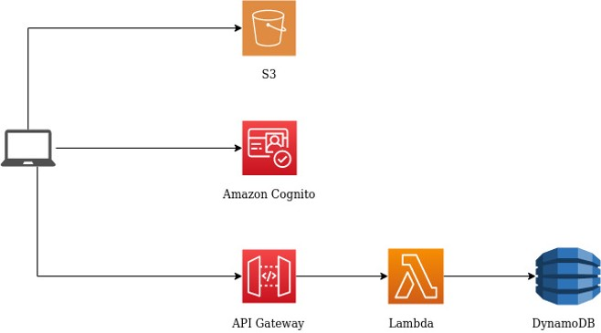

# SomsiadTyper

AWS Serverless app based on AWS lambda. 

Application allows users to rival with friends in guessing correct football matches' results. Exact result is rewarded with 3 points. Guessing which team will win is rewarded with 1 point. Wrong type is equal to 0 points.

Application uses AWS SAM framework for local testing and easier deployment.
Resources used by application are defined in `template.yaml` file.

Application enables admin to:
- Create new contest
- Add new match to contest
- Delete match from contest
- Enter finished matches' results

and regular user to:
- Create new account
- Upload profile picture
- View other users' profiles
- Enter own types for future matches
- View contest results
- View other users' types

# Architecture

# Deployment

App uses AWS SAM to build and test locally and also for deployment. For more information about SAM visit [SAM - Getting Started](https://docs.aws.amazon.com/serverless-application-model/latest/developerguide/serverless-getting-started.html).

There was also Bitbucket pipeline configured - `bitbucket-pipelines.yml` but since repository was moved to Github it may not work correctly.

Application also uses [SAR resource](https://serverlessrepo.aws.amazon.com/applications/arn:aws:serverlessrepo:us-east-1:375983427419:applications~deploy-to-s3) to deploy static website files to S3.

UI is based on [SB Admin 2](https://startbootstrap.com/themes/sb-admin-2/) theme.

# Technology Stack
- AWS CloudFormation
- AWS SAM
- AWS S3 - Static Website Hosting, Images Hosting
- AWS DynamoDB - Database
- AWS Cognito - User Management
- AWS lambda - Node.js - backend
